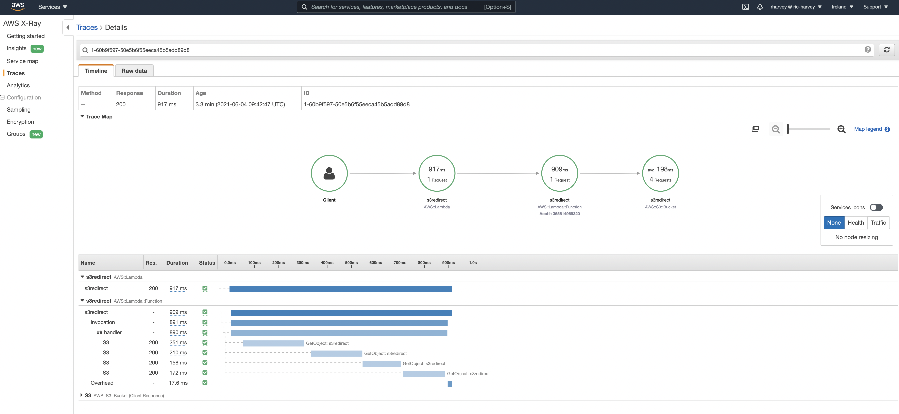
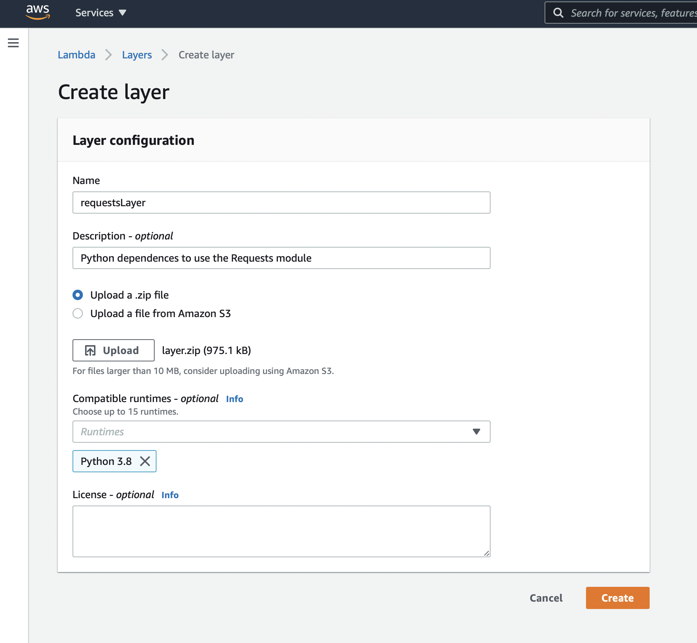

## **s3redirect**

A complete rewrite of a cli tool to become a fully fledge serverless and databaseless application that allows users to create a tiny URL by creating "Web Site Redirects" using Amazon S3, Lambda and Cloudfront. It now supports SafeBrowsing to stop users uploading malicious URL's

You can use the service hosted on https://s3r.io for free or host your own. The objects created have 0 bytes and use metadata only to create the redirect. This means your S3 costs are VERY low.

### **Requirements**

- AWS Account
- Power tools layer deployed 
- Custom requestLayer (adds requests module for python)
- ENV variables declared

### **Optional Features**

You can use Google's SafeBrowsing API to stop people adding bad url's to your redirector for this you'll need:

- Google Cloud API key
- SafeBrowsing API v4 enabled on your project

### **S3 and CloudFront setup**

Create an S3 bucket via the console or command line tools and enable *Static Website Hosting*. You need to enable the static website hosting to allow the 302 redirects to be served otherwise you'll just find that you don't get redirected and your browser just tries to download a null file.

At this point make a note of the URL for your S3 hosted site.

You could just choose a FQDN name for the bucket and serve content directly from this setup. However if you want to make this scale you'll want to add Amazon CloudFront into the equation.

Open the the CloudFront tab in the the AWS console and click create new distribution. Select download as the distribution method and click continue. When you click on the *Origin Domain Name* It will highlight all the S3 buckets you have. **DO NOT** select these otherwise you'll break the serving of the 302 redirects again. Instead enter the URL of the *Static Website Hosted bucket* you made a note of earlier. The Origin ID can be anything you want and its best just to go with the default.

The next set of options can be left as standard the only one that will be really important to you is the *Alternative Domain Names (CNAMES)* section where you get the chance to tweak the URL you access your distribution on. When you are happy with your settings click Create Distribution and wait for the config to propagate to all the CloudFront edge nodes.

Enable SSL and use ACM to generate you a new certificate.

### **Lambda + API Gateway setup**

First thing first lets install our lambda. The code is in this repository in the file **lambda_function.py**. Create a new lambda in the console using the python 3.7 runtime. For the IAM permissions you need the basic execute functions and then to add this policy (you can do this as a policy attachment or inline).

You'll need to tweak the policy to match your S3 bucket name you created in the last section:

```json
{
    "Version": "2012-10-17",
    "Statement": [
        {
            "Sid": "VisualEditor0",
            "Effect": "Allow",
            "Action": [
                "s3:DeleteObjectTagging",
                "s3:ListBucketByTags",
                "s3:GetBucketTagging",
                "s3:GetBucketWebsite",
                "s3:GetObjectVersionTagging",
                "s3:ListBucketVersions",
                "s3:GetBucketLogging",
                "s3:ListBucket",
                "s3:GetAccelerateConfiguration",
                "s3:GetBucketNotification",
                "s3:GetObjectVersionTorrent",
                "s3:PutObject",
                "s3:GetObjectAcl",
                "s3:GetObject",
                "s3:PutBucketNotification",
                "s3:PutBucketTagging",
                "s3:GetBucketCORS",
                "s3:GetObjectTagging",
                "s3:PutObjectTagging",
                "s3:DeleteObject",
                "s3:GetBucketLocation",
                "s3:PutObjectAcl",
                "s3:GetObjectVersion"
            ],
            "Resource": [
                "arn:aws:s3:::<YOUR_BUCKET>/*",
                "arn:aws:s3:::<YOUR_BUCKET>"
            ]
        },
        {
            "Sid": "VisualEditor1",
            "Effect": "Allow",
            "Action": [
                "s3:ListAllMyBuckets",
                "s3:HeadBucket"
            ],
            "Resource": "*"
        }
    ]
}
```

Now make sure you copy the code from **lambda_function.py** into the console and save the function.

Now in the triggers section of the console you'll need to add a API Gateway integration. You'll want to use __default__ for the stage and you'll need to create a method called **/create** this should be of type **POST** (enable CORS)

Make sure you enable CORS for this method. Now under **Method Execution** we need to set a mapping to get the right information into the lambda function from the front end. Create a new mapping with the type:

__application/x-www-form-urlencoded__

Enter the following mapping into the new field. This is responsible for transforming our post from the web frontend to the values needed by the lambda.

```
{
    "body-json": {
        #foreach( $token in $input.path('$').split('&') )
            #set( $keyVal = $token.split('=') )
            #set( $keyValSize = $keyVal.size() )
            #if( $keyValSize >= 1 )
                #set( $key = $util.urlDecode($keyVal[0]) )
                #if( $keyValSize >= 2 )
                    #set( $val = $util.urlDecode($keyVal[1]) )
                #else
                    #set( $val = '' )
                #end
                "$key": "$val"#if($foreach.hasNext),#end
            #end
        #end
    }
}
```

Deploy the API gateway and copy the invoke rule (API_GATEWAY_URL). You'll need this for setting up the frontend.

#### Variables for debug and SafeBrowsing API

I've added some new features recently. The first handles debugging and uses the lambdapowertools-python layer to add tracing to the application which is useful for debug purposes as seen in the screenshot below.



In order to make this work you'll need to add some ENV variables to the Lambda Function set ``POWERTOOLS_TRACE_DISABLED`` to _false_ to see the traces in cloudwatch.

I've also implimented Googles Safe Browsing API lookup as a check. This will stop people adding bad URL's to your site allowing users to be tricked into visiting them. You are going to need a Google API key to make this work. Visit here [https://developers.google.com/safe-browsing/v4/](https://developers.google.com/safe-browsing/v4/) to get one and enable the SafeBrowsing API.

You'll then need to include the ENV vars for you functions of ``SafeBrowsing`` which can be _true_ or _false_ and the ``SafeBrowsing_API_KEY`` which should contain your API key from google.

__N.B. You must have these variables set even if you are not using the features!!!__

#### Adding the lambda layers

I've added some debugging to the code and I'm using the awesome Lambda-powertools-python which can be installed with CloudFormation by clicking here: [https://serverlessrepo.aws.amazon.com/applications/eu-west-1/057560766410/aws-lambda-powertools-python-layer](https://serverlessrepo.aws.amazon.com/applications/eu-west-1/057560766410/aws-lambda-powertools-python-layer)

You'll also need the python requests module, this is used to check the URL against Google Safe Browsing API. to add this create a new Lambda Layer in the console, call it _requetsLayer_ and upload the zip file called Layer.zip included in the git directory, select python 3.8 for the run time.




##### Building your own requestsLayer

If you don't want to use the included layer.zip you can build your own layer. you'll need docker installed locally to run this. First create a new directory called python in the root of this repository.

```bash
mkdir python
```

You'll then need to run the command:

```bash
docker run --rm \
--volume=$(pwd):/lambda-build \
-w=/lambda-build \
lambci/lambda:build-python3.8 \
pip install -r requirements.txt --target python
```

This will install all the required componants in the python directory then produce a new layer.zip file for you to create your own layer.

### **Deploy the frontend**

In this directory there are two files:

- **index.html**
- **style.css**

First you need to edit **index.html** and update the following values:

- **\<API\_GATEWAY\_URL\>**
- **\<BUCKET\_NAME\>**
- **\<URL\>** x3

Once you've edited **index.html** upload that and **style.css** to the S3 bucket you created and then make them public.

Now browse to your URL and you should be up and running.
